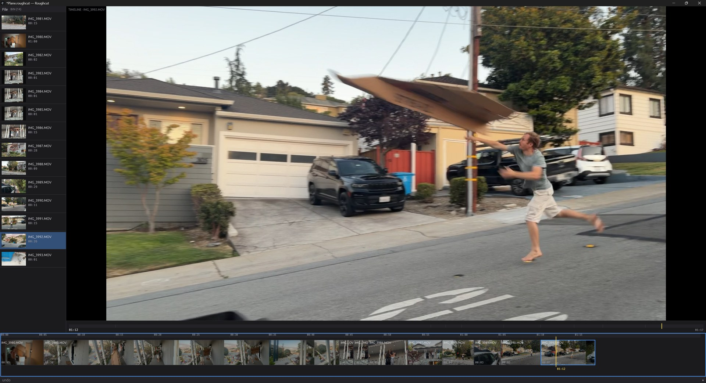

# Roughcut

Assemble a rough cut fast, then finish it in Shotcut.

Point Roughcut at a folder of video and photos, skim it, mark the good bits,
and build an ordered sequence. Export a `.mlt` project that Shotcut opens with
every cut exactly where you put it.

It is deliberately small: no effects, transitions, titles, or a second video
track — all Shotcut's job. Audio tracks it does have, for music and effects.

## What you need

Windows 10 or 11, plus **[Shotcut](https://shotcut.org)** (it supplies `ffprobe`
and `ffmpeg`, which Roughcut finds on its own — and you want it anyway to finish
the edit) and **[mpv](https://mpv.io)** for playback. Without mpv everything
still works except the picture.

An Apple Silicon macOS development build is also verified locally; see
[Mac setup and limitations](docs/macos.md).

## Using it

Drop files on the window, or press `Ctrl+I`. The whole loop is three keys:

| Key | Does |
| --- | --- |
| `I` | mark where a good bit starts |
| `O` | mark where it ends |
| `A` | append it to the timeline |

Then repeat. `Space` or a click on the picture plays, `←` `→` step a frame,
`Tab` moves between source and timeline. `S` splits, `X` deletes and closes the
gap — Shotcut's keys. `T` reads the clip instead: select a sentence and `A` cuts
exactly that to the timeline. Hover a thumbnail to skim it; middle-click to flag
one. Drag clips onto the timeline, along it to reorder, or by an edge to retrim;
drag the ruler to scrub and middle-drag to pan. Right-click a clip to rotate one
shot sideways. **Press `?` for the full keyboard map**, or read [KEYS.md](KEYS.md).

`Ctrl+E` exports, sized and timed from the clips you used: a `.mlt` to finish
in Shotcut, or an MP4 straight out. Your work saves itself and survives a crash.

## Building it, or changing it

Start with [docs/building.md](docs/building.md), which indexes the rest —
including [automation.md](docs/automation.md), on driving all of this headless
from a script or an AI agent, with no window at all.

## Licence

**GPL-3.0-or-later** — see [LICENSE](LICENSE), [NOTICES.md](NOTICES.md) and
[docs/licensing.md](docs/licensing.md). Issues and pull requests welcome — see
[CONTRIBUTING.md](CONTRIBUTING.md), which also describes the remaining macOS work.
